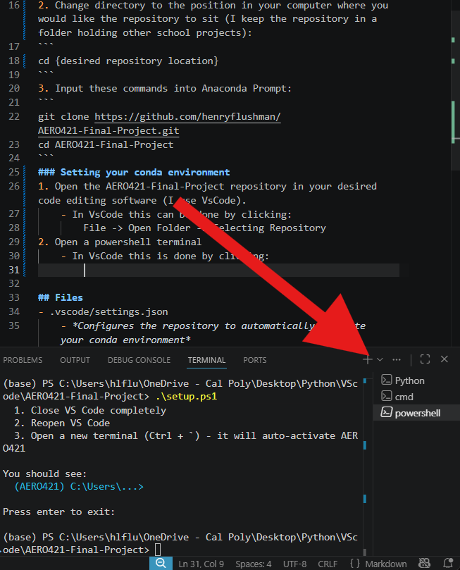

# AERO 421 Final Project

## Team Members
- Henry Flushman
- Jackson William Mehiel
- Nick Schaeffer

## Project Description
AERO 421 Final Project, using the Python based `control-systems` library

## Installation Guide
The setup process of this repository should be fairly straight-forward if you already have conda installed, otherwise it might be slightly difficult. For this reason I will only describe the setup process for users with conda already installed. The process for installing Anaconda will be in another file titled `ANACONDAINSTALL.md`

### Copying the Repo to Your Computer
1. Open Anaconda Prompt
2. Change directory to the position in your computer where you would like the repository to sit (I keep the repository in a folder holding other school projects):
```
cd {desired repository location}
```
3. Input these commands into Anaconda Prompt:
```
git clone https://github.com/henryflushman/AERO421-Final-Project.git
cd AERO421-Final-Project
```
### Setting your conda environment
1. Open the AERO421-Final-Project repository in your desired code editing software (I use VsCode).
    - In VsCode this can be done by clicking:
        File -> Open Folder -> Selecting Repository

2. Open a PowerShell terminal
    - In VsCode this is done by clicking the dropdown arrow seen below.
    - A dropdown menu should appear with one of the options being PowerShell, select this.




3. In the PowerShell terminal type:
```
.\setup.ps1
```
4. Once this shell script has properly installed a new conda environment and all of the correct dependencies, try to run `MassProperties_Part1.py`.

5. What you should see in the terminal is `(AERO421)` before your directory. The script should print out the answers to the mass properties problem of the final project.

*If there are any problems with not seeing `(AERO421)` before your directory then the repository is not properly activating your conda environment and you will need to contact me for help*

## Folders and Files
- `.vscode/settings.json`

*Configures the repository to automatically activate your conda environment.*

*Listed in `.gitignore` as the environment path is unique between computers.*

- `code/`

*A folder containing all python/matlab scripts needed to complete the AERO421 Final Project.*
- `data/`

*A folder containing all relevant data needed in the repository (e.g. .txt files, images, data files).*
- `.gitignore`

*A file meant to communicate with git as to what files in the repository should be considered when staging a new commit.*
- `environment.yml`

*A header describing what dependencies are necesarry for this repository and their corresponding versions*
- `setup.ps1`

*A shell script designed to interface with Microsoft PowerShell that uses `environment.yml` to automatically create and download all the necessary dependencies for this repository, and subsequently creates your unique `settings.json` file.*